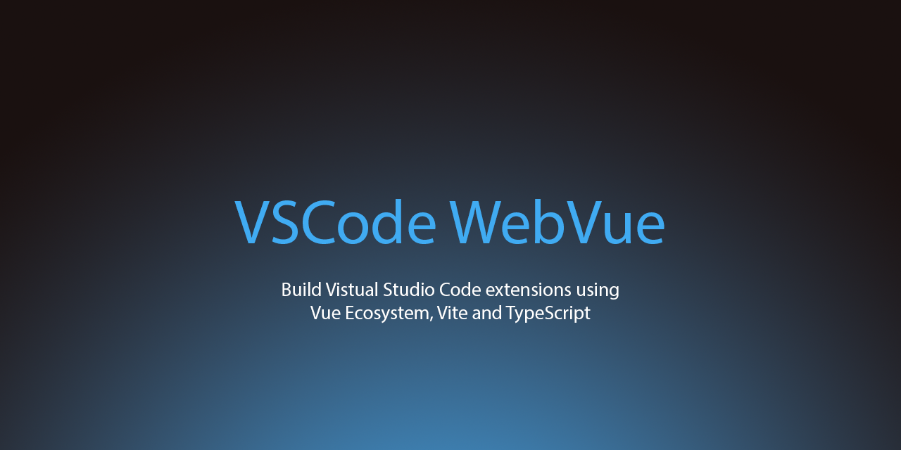

# vscode-webvue



An easy solution for building visual studio code extensions using vue and vite ecosystem ⚡

## 🚀 How to use


### Install dependencies

```bash
yarn
```

For running project in development mode use

```bash
yarn watch
```

### Adding more commands

Then after VSCode development host opens, use command pallet and select the `hello world` command.

To add more commands to your extension, edit the `package.json` located in the `/packages/extension` directory, and use the keys in your `extension.ts` file using `vscode.commands.registerCommand` method.

## 🔧 How it works

The project is built with monorepo structure containing two packages. The first one being the client, and the second being the visual studio code extension program.

when you start developing on the `/packages/client/` vue application directory, your changes will be watched using nodemon, then rebuilt and be opened inside vscode extension host ready to be used with vscode command pallet!

Here you can see your vue project already built and injected using vscode webview API. you can utilize the full functionality of vue such as its amazing reactivity and its available additions (like `vue-router`) out of the box!

Inside the vue application code, the `vscode` object is globally accessible and can be used to send messages to the vscode runtime and perform tasks such as read/writing files, etc.


## 📄 Blogs

[Developing a VS Code Extension using Vue 3 and WebView Panels API](https://medium.com/@mhdi_kr/developing-a-vs-code-extension-using-vue-3-and-webview-panels-api-536d87ce653a)

## 🤝 Contribution

If you have any questions or recommendations please create a new issue for it, and if you've hacked together any feature or enhancement, a pull request is more than welcome here! 🙏